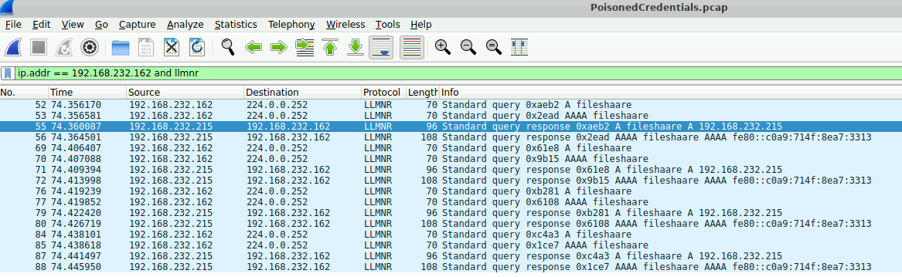

# PoisonedCredentials Lab

Created time: August 28, 2025 2:41 PM
Note Status: In progress
Priority: HIGH
Tags: IP, Networks, Protocols, Security, labs, networking, offense, threats
Type: Writeups

## AIM

Analyze network traffic for LLMNR/NBT-NS poisoning attacks using Wireshark to identify the rogue machine, compromised accounts, and affected systems.

# **Understanding the Protocols**

**LLMNR (Link-Local Multicast Name Resolution)** and **NBT-NS (NetBIOS Name Service)** are Microsoft Windows components that serve as fallback methods for name resolution. When a computer on a network cannot find an IP address for a hostname using the primary method, the Domain Name System (DNS), it will broadcast a query to the entire local network using LLMNR or NBT-NS, essentially asking if any machine knows the IP address for that hostname.

## Attack Workflow

An attacker on the same local network can exploit this broadcast mechanism. Here's a step-by-step breakdown of how the attack unfolds:

1. **A User Makes a Typo**: A user on the network attempts to access a network share, for example, `\\fileserver1`, but accidentally types `\\fileservr1`.
2. **DNS Fails**: The local DNS server does not have an entry for `fileservr1`, so the DNS query fails.
3. **LLMNR/NBT-NS Broadcast**: Because the DNS lookup failed, the user's computer broadcasts a query to the entire local network, asking, "Who is `fileservr1`?"
4. **The Attacker Responds**: An attacker on the same network is listening for these LLMNR/NBT-NS broadcasts. They see the request for `fileservr1` and quickly send a response to the user's computer, falsely claiming, "I am `fileservr1`, and my IP address is [Attacker's IP address]."
5. **The Victim Connects**: The user's computer trusts this response and attempts to connect to the attacker's machine to access the network share.
6. **Credential Theft**: When the victim's computer connects, it will try to authenticate with the attacker's machine. The attacker's machine will prompt for a username and password. The user, thinking they are connecting to the legitimate file server, will enter their credentials. The attacker can then capture these credentials. A common method is to capture the NTLMv2 hash of the user's password, which can then be cracked offline.

## **Why This Attack is Effective**

This attack is particularly effective on **internal networks** where **LLMNR** and **NBT-NS** are often **enabled by default**. The core of the vulnerability lies in the fact that **these protocols have no way of verifying the authenticity of the responses they receive**. Any machine on the local network can respond to a broadcast, and the client that sent the request will typically trust the first response it gets.

---

# Attack Scenario

Your organization's security team has detected a surge in suspicious network activity. There are concerns that LLMNR (Link-Local Multicast Name Resolution) and NBT-NS (NetBIOS Name Service) poisoning attacks may be occurring within your network. These attacks are known for exploiting these protocols to intercept network traffic and potentially compromise user credentials. Your task is to investigate the network logs and examine captured network traffic.

# Questions

1. In the context of the incident described in the scenario, the attacker initiated their actions by taking advantage of benign network traffic from legitimate machines. Can you identify the specific mistyped query made by the machine with the IP address 192.168.232.162?
    
    —> fileshaare (Two a’s)
    
    
    
    You can find this when you apply the filters for viewing only packets from the IP 192.168.232.162 and only show packets with `llmnr` protocol.
    

1. We are investigating a network security incident. To conduct a thorough investigation, We need to determine the IP address of the rogue machine. What is the IP address of the machine acting as the rogue entity?
—> `192.168.232.215` 
    
    
    
    `192.168.232.215` is the rogue device in this capture, as it’s responding to a mistyped broadcast query that should not respond with any legitimate response.
    
    
    

1. As part of our investigation, identifying all affected machines is essential. What is the IP address of the second machine that received poisoned responses from the rogue machine?
    
    —>`192.168.232.176`
    
    
    
    Looking closely, after the poisoned reply given to `192.168.232.162` (pckt no. 51) the next reply goes to (pckt no 145) `192.168.232.176` 
    
2. We suspect that user accounts may have been compromised. To assess this, we must determine the username associated with the compromised account. What is the username of the account that the attacker compromised?
    
    —> `janesmith`
    
    
    
    Looking a the traffic we can see a SMB negotiation and session setup requests and in that info column shows the username `janesmith`
    

1. As part of our investigation, we aim to understand the extent of the attacker's activities. What is the hostname of the machine that the attacker accessed via SMB?
—> ACCOUNTINGPC
    
    
    
    Looking at the ‘session setup request’ packet, diving more into the data of the packet we can find the Computers name. precisely go to NTLM Secure Service Provider > Target Info to find the name of the pc in the attribute “NETBIOS Computer Name”.
    

---

# Conclusion

The analysis of the provided network traffic capture confirms a successful **LLMNR/NBT-NS poisoning attack.** The rogue machine, identified with the IP address **`192.168.232.215`**, actively monitored the local network for name resolution broadcasts. It exploited a mistyped query for "**fileshaare**" from the victim machine at `192.168.232.162` and also targeted a second system at `192.168.232.176`.

This incident highlights a critical network vulnerability. The immediate recommendations are to **isolate the rogue machine**, **force a password reset for the compromised account**, and **investigate the `ACCOUNTINGPC` for further compromise**. For long-term prevention, it is strongly advised to **disable LLMNR and NBT-NS** across the network through Group Policy to eliminate this attack vector.